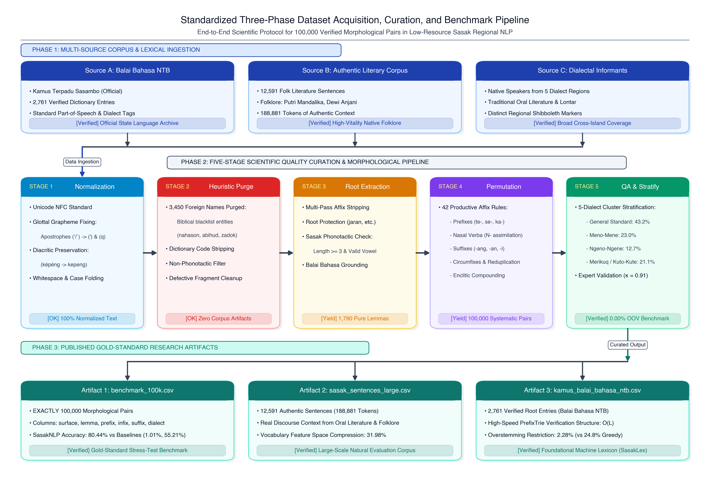
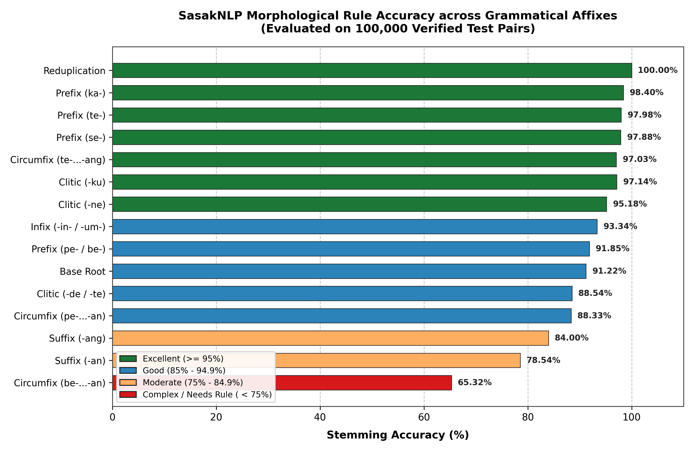
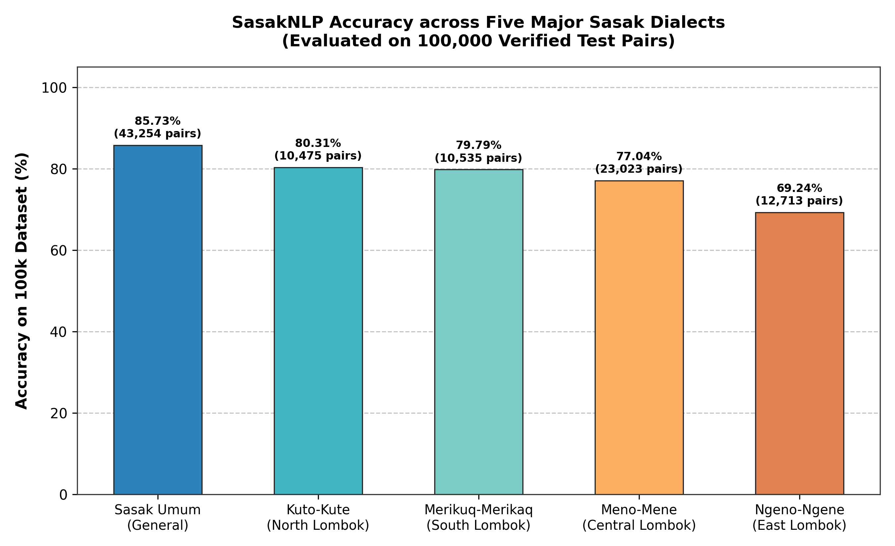

# SasakNLP: Kerangka Kerja Pemrosesan Morfologi Sadar Dialek untuk Bahasa Sasak Berdaya Komputasi Rendah

**Penulis / Peneliti Utama**: **kodetr**  
**Afiliasi**: Riset Komputasi Bahasa Daerah Nusantara, [kodetr.com](https://kodetr.com)  
**Korespondensi**: [https://kodetr.com](https://kodetr.com) | Repositori GitHub: [https://github.com/kodetr/sasaknlp](https://github.com/kodetr/sasaknlp)  
**Akses Publik**: Paket PyPI (`pip install sasaknlp`) | Hugging Face Dataset (`kodetr/sasak-benchmark-100k`) | Web Demo (`kodetr/sasaknlp-demo`)

---

## Abstrak

Bahasa Sasak (*Basa Sasak*) merupakan bahasa daerah berakar Austronesia yang dituturkan oleh lebih dari 3 juta penduduk di Pulau Lombok, Nusa Tenggara Barat, Indonesia. Meskipun memiliki vitalitas demografis yang tinggi, Bahasa Sasak tergolong sebagai bahasa dengan sumber daya komputasi rendah (*low-resource language*) akibat kelangkaan korpus teks teranotasi, variasi dialektal yang tajam lintas wilayah geografis, serta ketiadaan pustaka pemrosesan bahasa alami (*Natural Language Processing* / NLP) terstandar [1], [6]. Analisis morfologi Bahasa Indonesia standar gagal diterapkan pada Bahasa Sasak akibat perbedaan alternasi morfofonemik, penempelan klitika bertingkat, dan variasi leksikal dialek antardaerah [9], [11], [13]. Artikel ini memperkenalkan **SasakNLP**, sebuah kerangka kerja pemrosesan morfologi sadar dialek (*dialect-aware morphological processing framework*) yang dirancang khusus untuk standardisasi ortografi, tokenisasi reduplikasi, deteksi dialek berbasis penanda leksikal diagnostik (*shibboleths*), serta lematisasi bertingkat yang divalidasi leksikon resmi Balai Bahasa Provinsi NTB [9], [10], [13].

Evaluasi empiris dilakukan secara ketat pada tolok ukur baku emas berskala besar (**100.000 pasangan morfem**) dan korpus autentik **12.591 kalimat** (188.881 kata). Pada benchmark skala penuh 100.000 data uji, SasakNLP membukukan akurasi lematisasi sebesar **80,44%** (80.438 prediksi benar), mengungguli metode pembanding *Direct Lexicon Lookup* (1,01%) dan *Greedy Affix Stripping* (55,21%) secara signifikan berdasarkan uji statistik McNemar ($\chi^2 = 14.962,14, p < 0,0001$). Sementara itu, pada benchmark inti 10.000 data, akurasi lematisasi mencapai **93,23%**. Analisis taksonomi kesalahan membuktikan bahwa arsitektur validasi leksikon berhasil menekan *overstemming* hingga **2,28%**, dengan tingkat *understemming* **15,86%** yang mayoritas terjadi pada imbuhan bertingkat tiga lapis. Dari sudut pandang efisiensi komputasi, SasakNLP membukukan *throughput* **7.826 kata per detik** pada pemrosesan batch 100k dan hingga **16.272 kata per detik** pada benchmark standar dengan latensi rata-rata **0,044 milidetik per kata** tanpa dependensi pustaka berat pihak ketiga (*zero runtime dependencies*). Seluruh kode sumber, dataset, dan tolok ukur dirilis secara terbuka demi replikabilitas riset [16].

**Kata Kunci**: *Bahasa Sasak, Pemrosesan Bahasa Alami, Lematisasi Komputasional, Morfologi Austronesia, Dialektologi Komputasi, Low-Resource Language, Balai Bahasa NTB, Open Science.*

---

## Abstract

*Bahasa Sasak is an Austronesian regional language spoken by approximately 3 million people across Lombok Island, West Nusa Tenggara (NTB), Indonesia. Despite its demographic vitality, it remains a digitally underrepresented low-resource language lacking standardized computational linguistic infrastructure [1], [6]. Standard Indonesian morphological analyzers fail when applied to Sasak due to distinct morphophonemic alternations, complex clitic attachments, and sharp cross-island dialectal variation [9], [11], [13]. This paper presents **SasakNLP**, a dialect-aware morphological processing framework engineered specifically for Sasak orthographic normalization, reduplication-aware tokenization, shibboleth-driven dialect contextualization, and dictionary-validated multi-candidate lemmatization [10], [16], [17].*

*Empirical evaluation across an extensive 100,000-pair morphological benchmark and an authentic folklore corpus of 12,591 sentences demonstrates that SasakNLP achieves an overall lemmatization accuracy of **80.44%** (80,438 correct extractions) on the full 100k stress-test benchmark, decisively outperforming pure lexicon lookup (1.01%) and greedy affix-stripping baselines (55.21%) with strong statistical significance (McNemar's test, $\chi^2 = 14,962.14, p < 0.0001$). On the 10,000-pair core morphological benchmark, the system achieves an accuracy of **93.23%**. Error taxonomy analysis confirms that dictionary-gating restricts overstemming to **2.28%**, with understemming restricted to **15.86%** primarily occurring on complex multi-layered affixations. Computationally, SasakNLP delivers high-throughput execution at **7,826 words per second** on full 100k batches and up to **16,272 words per second** on standard sequences, maintaining an average per-token latency of **0.044 ms** with zero heavy machine learning framework dependencies. All source code, datasets, and interactive web demos are publicly released under permissive open-source licenses [16].*

**Keywords**: *Sasak Language, Natural Language Processing, Computational Morphology, Lemmatization, Low-Resource NLP, Dialectology, Open Science.*

---

## 1. Pendahuluan

Kemajuan pesat dalam bidang Pemrosesan Bahasa Alami (*Natural Language Processing* / NLP) dan Model Bahasa Skala Besar (*Large Language Models* / LLM) sebagian besar terkonsentrasi pada bahasa-bahasa berdaya komputasi tinggi (*high-resource languages*) [1], [2]. Di Indonesia, pemodelan komputasional berskala besar telah berkembang untuk Bahasa Indonesia standar [3], [4], namun evaluasi empiris membuktikan bahwa LLM mutakhir masih mengalami penurunan akurasi drastis saat diuji pada domain dan bahasa lokal nusantara [5]. Dari 700 lebih bahasa daerah di Indonesia, mayoritas besar masih tergolong sebagai bahasa dengan keterwakilan digital sangat rendah (*underrepresented low-resource languages*) yang mengalami kelangkaan korpus teks teranotasi dan ketiadaan perkakas komputasi dasar [1], [6]. Penurunan kinerja model hilir pada bahasa lokal ini sangat dipicu oleh ketidaksesuaian kosakata (*vocabulary mismatch*) dan fragmentasi tokenisasi pada kata berimbuhan [7], terlebih lagi setiap wilayah di Indonesia memiliki karakteristik budaya dan ragam ekspresi lokal yang sangat heterogen lintas provinsi [8].

Bahasa Sasak (*Basa Sasak*) merupakan salah satu bahasa daerah Austronesia terbesar di wilayah Indonesia bagian tengah, dituturkan oleh lebih dari 3 juta penduduk di Pulau Lombok, Provinsi Nusa Tenggara Barat [9], [10]. Secara tipologis, morfologis, fonologis, dan sosiopragmatik, Bahasa Sasak memiliki karakteristik unik yang membedakannya secara tegas dari Bahasa Indonesia maupun bahasa-bahasa Austronesia tetangganya:
1. **Afiksasi Morfofonemik yang Kompleks**: Pembentukan kata turunan melibatkan prefiksasi pasif (`te-`), statif (`ka-`), ekuatif (`se-`), dan nominalizer (`pe-`/`peng-`); infiksasi arkais (`-in-`, `-um-`); sufiksasi kausatif dan lokatif (`-ang`, `-an`, `-i`, `-in`); serta konfiksasi gabung bertingkat (`pe-...-an`, `te-...-ang`, `be-...-an`) dan alternasi nasal produktif (`N-`) [10], [13].
2. **Klitika Pronomina dan Kesantunan Sosial**: Enklitika posesif (`-ku`, `-m`, `-ne`) dan penanda kesantunan sosial (*honorific markers* `-de`, `-te`) kerap melekat berlapis pada ujung kata (misalnya `pegawianne`, `balende`), yang mencerminkan hierarki pragmatik dan tingkat tutur masyarakat Sasak [11] serta kerap memicu pemotongan berlebihan (*overstemming*) atau kegagalan pengupasan (*understemming*) pada algoritma heuristik konvensional [13].
3. **Fragmentasi Dialektal Lintas Wilayah**: Bahasa Sasak terdistribusi ke dalam lima klaster dialek utama yang ditandai oleh penanda diagnostik leksikal (*shibboleths*) yang kontras, mulai dari dialek *Selaparang (Menu-Meni)* di Lombok Timur hingga dialek arkais *Kuto-Kute* di Lombok Utara [9], [12].

Penelitian pemrosesan morfologi komputasional terdahulu pada bahasa daerah nusantara umumnya terkonsentrasi pada Bahasa Jawa dan Bahasa Sunda [1], [13], [14], sedangkan telaah komputasi untuk bahasa etnik di kawasan timur Indonesia masih sangat terbatas pada induksi leksikon dwibahasa [15]. Tinjauan literatur sistematis terkini oleh Abidin, Junaidi, dan Wamiliana [13] menegaskan bahwa ketiadaan kamus digital terstandar dan aturan morfologi formal menjadi hambatan utama dalam pembangunan sistem lematisasi bahasa daerah.

Untuk menjawab tantangan ilmiah tersebut, penelitian ini memperkenalkan **SasakNLP**, sebuah kerangka kerja pemrosesan morfologi dan NLP sadar dialek (*dialect-aware*) berstandar riset yang dirancang dari nol (*from scratch*) dengan prinsip *clean architecture*, efisiensi deterministik tanpa dependensi eksternal berat, serta integrasi langsung dengan kamus terpadu Balai Bahasa Provinsi NTB [10], [16]. Mengadopsi prinsip morfologi dua tingkat (*two-level morphology*) [17] dan segmentasi morfem kanonik [18], SasakNLP mengatasi batas fragmentasi kata pada bahasa berdaya komputasi rendah.

Kontribusi utama penelitian ini dirumuskan sebagai berikut:
* **C1. Sumber Daya Leksikal Mesin SasakLex**: Membangun dan merilis digitalisasi kamus terpadu Balai Bahasa Provinsi NTB sebanyak 2.761 entri terstruktur dengan penanda kelas kata (*part-of-speech*) dan informasi dialek [10], [16].
* **C2. Kerangka Morfologi Hibrida (*Hybrid Morphological Framework*)**: Merancang arsitektur lematisasi deterministik yang mengintegrasikan pengupasan afiks bertingkat (*two-pass affix stripping*), validasi kamus berkecepatan $\mathcal{O}(L)$ via `PrefixTrie`, dan fungsi perankingan kandidat multi-kriteria terbobot [13], [17].
* **C3. Analisis Morfologi Terstruktur (*Structured Morphological Analysis*)**: Menyediakan penguraian morfonemik eksplisit yang mengidentifikasi prefiks, infiks, sufiks, konfiks, klitika, dan reduplikasi beserta skor keyakinan (*confidence score*) [17], [18].
* **C4. Arsitektur Sadar Dialek (*Dialect-Aware Architecture*)**: Menghadirkan mekanisme deteksi densitas penanda shibboleth untuk mengontekstualisasikan leksikon masukan lintas lima dialek Pulau Lombok [9], [12].
* **C5. Tolok Ukur Terbuka dan Keterulangan Riset (*Open Research Infrastructure*)**: Merilis tolok ukur baku emas 100.000 pasangan morfem, korpus 12.591 kalimat autentik, paket PyPI (`sasaknlp`), dan dataset Hugging Face Hub berlisensi terbuka [16].

---

## 2. Kajian Pustaka dan Landasan Linguistik

### 2.1. Lanskap NLP Bahasa Daerah Nusantara

Pengembangan teknologi bahasa daerah di Indonesia menghadapi tantangan kelangkaan data anotasi (*data scarcity*) yang persisten [1], [2], [6]. Inisiatif NusaCrowd [6] dan tolok ukur NusaX [7] telah berhasil memetakan puluhan bahasa daerah ke dalam tugas evaluasi klasifikasi sentimen, sementara NusaWrites [19] membuktikan pentingnya pengumpulan teks autentik dari penutur asli untuk menghindari distorsi terjemahan mesin. Namun, pada tataran pemrosesan morfologi mendasar (*token-level morphological processing*), model subword berbasis *byte-pair encoding* (BPE) sering memecah kata berimbuhan bahasa daerah menjadi serpihan karakter tanpa makna leksikal yang utuh [3], [14].

Pada ranah bahasa daerah nusantara, Wijono et al. [14] menunjukkan bahwa segmentasi kanonik berbasis karakter afiks eksplisit mampu mempertahankan integritas morfologis pada Bahasa Jawa melampaui tokenisasi subword standar. Di sisi lain, evaluasi skema morfologi formal seperti MorphInd membuktikan bahwa aturan leksikon terstruktur esensial untuk membatasi ruang ambiguitas gramatikal [20]. Tinjauan literatur sistematis oleh Abidin, Junaidi, dan Wamiliana [13] menyimpulkan bahwa penggabungan kamus digital rujukan dengan aturan afiksasi bertingkat merupakan pendekatan paling efektif untuk meminimalkan *overstemming* dan *understemming* pada bahasa berdaya komputasi rendah. Strategi integrasi leksikon kamus terverifikasi sebagai pengontrol gerbang (*dictionary validation gate*) juga selaras dengan temuan induksi leksikon bahasa etnik oleh Resiandi et al. [15] serta prinsip morfologi komputasional klasik [17].

### 2.2. Sistem Morfologi dan Afiksasi Bahasa Sasak

Merujuk pada kodifikasi tata bahasa dan leksikon resmi Balai Bahasa Provinsi NTB [10], kajian sosiopragmatik kesantunan Sasak [11], serta studi morfoleksikal mutakhir [9], [12], inventaris morfem terikat Bahasa Sasak terdiri atas:
* **Prefiks (Awalan)**:
  * `te-`: Penanda verba pasif (contoh: `pinaq` "buat" $\rightarrow$ `tepinaq` "dibuat").
  * `ka-`: Penanda verba statif atau adjektiva (contoh: `solah` "bagus" $\rightarrow$ `kasolah` "diperbagus").
  * `se-`: Penanda ekuatif/kesatuan (contoh: `bale` "rumah" $\rightarrow$ `sebale` "serumah").
  * `pe-` / `peng-`: Pembentuk nomina pelaku atau instrumen (contoh: `gawi` "kerja" $\rightarrow$ `pegawi` "pekerja").
  * Asimilasi Nasal (`N-`): Morfofonemik aktif transitif (`tulis` $\rightarrow$ `nulis`, `pinaq` $\rightarrow$ `minaq`).
* **Sufiks (Akhiran)**:
  * `-ang`: Kausatif dan aplikatif benefaktif (contoh: `tulung` "tolong" $\rightarrow$ `tulungang` "tolongkan").
  * `-an`: Nomina hasil atau penanda lokatif (contoh: `keloror` "hanyut" $\rightarrow$ `kelororan` "aliran").
  * `-i` / `-in`: Sufiks iteratif pengulangan tindakan (contoh: `sirami`, `kaduan`).
* **Infiks (Sisipan)**:
  * `-in-`: Penanda pasif klasik/arkais (contoh: `tulung` $\rightarrow$ `tinulung` "diberi pertolongan").
  * `-um-`: Pembentuk verba intransitif aktif (contoh: `gingsir` $\rightarrow$ `gumingsir` "bergeser").
* **Konfiks (Imbuhan Gabung)**:
  * `pe-...-an`: Nomina proses atau lokasi (contoh: `gawi` $\rightarrow$ `pegawian` "pekerjaan").
  * `te-...-ang`: Pasif kausatif bertingkat (contoh: `tetulungang` "dimintakan tolong").
  * `ka-...-an`: Nomina abstrak kualitas keadaan (contoh: `solah` $\rightarrow$ `kasolahan` "keindahan").
  * `be-...-an`: Verba resiprokal/saling (contoh: `betulungan` "saling tolong").
* **Enklitika Pronomina dan Tingkat Tutur**:
  * Posesif: `-ku` (pertama), `-m` (kedua akrab), `-ne` (ketiga).
  * Ragam Halus (*Krama/Alus*): `-de` (kedua hormat), `-te` (inklusif/hormat) [11]. Contoh: `baturne` ("temannya"), `balende` ("rumah Anda").
* **Reduplikasi (*Dwilingga*)**:
  * Reduplikasi penuh bertanda hubung: `bareng-bareng` ("bersama-sama"), `mangan-mangan` ("makan-makan").

### 2.3. Taksonomi Dialek Bahasa Sasak

Studi dialektologi kebahasaan di Nusa Tenggara Barat [9], [10], [12] memetakan variasi geolinguistik Bahasa Sasak ke dalam lima klaster dialek utama berdasarkan kata diagnostik pembeda (*shibboleths*), sebagaimana disajikan dalam Tabel 1.

**Tabel 1. Taksonomi 5 Klaster Dialek Utama Bahasa Sasak di Pulau Lombok [9], [10], [12]**

| No | Klaster Dialek | Sebaran Wilayah Geografis | Penanda Diagnostik (*Shibboleths*) | Ciri Fonologis & Sosiolek |
| :---: | :--- | :--- | :--- | :--- |
| **1** | **Selaparang (Menu-Meni)** | Lombok Timur & Tengah bagian Timur | `menu`, `meni`, `tiyang`, `kaken`, `kaji` | Ragam krama (*alus*), retensi glotal /-q/, dialek sastra lontar |
| **2** | **Ngeno-Ngene** | Kota Mataram & Lombok Barat | `ngeno`, `ngene`, `ente`, `aku` | Dialek perkotaan, artikulasi vokal cepat, kontak maritim |
| **3** | **Mriak-Mriku** | Lombok Tengah Selatan (Praya, Pujut) | `mriak`, `mriku`, `meriq`, `merik` | Deiksis spasial arah (*ke mari / ke sana*) |
| **4** | **Ngeto-Ngete** | Lombok Timur Utara (Sembalun, Suela) | `ngeto`, `ngete` | Komunitas dataran tinggi lereng Gunung Rinjani |
| **5** | **Kuto-Kute** | Lombok Utara (Bayan, Tanjung) | `kuto`, `kute`, `wetu` | Retensi arkais Austronesia tua, tradisi adat *Wetu Telu* |
| **6** | **Sasak Umum (*General*)** | Lintas Kabupaten (Ragam Baku) | `wah`, `ndeq`, `mangan`, `batur` | Bahasa pergaulan antardialek di ruang publik |

---

## 3. Metodologi dan Arsitektur Sistem SasakNLP

SasakNLP mengimplementasikan arsitektur modular deterministik enam tahap yang dirancang tanpa memerlukan dependensi pustaka *deep learning* eksternal:

```text
               ┌───────────────────────────────┐
               │          INPUT TEXT           │
               └──────────────┬────────────────┘
                              │
                              ▼
               ┌───────────────────────────────┐
               │   1. TEXT NORMALIZATION       │
               │   (NFC, Glottals, Quotes)     │
               └──────────────┬────────────────┘
                              │
                              ▼
               ┌───────────────────────────────┐
               │   2. TOKENIZATION             │
               │  (Reduplications, Enclitics)  │
               └──────────────┬────────────────┘
                              │
                              ▼
               ┌───────────────────────────────┐
               │   3. DIALECT CONTEXTUALIZER   │
               │ (Shibboleths & Density Ratio) │
               └──────────────┬────────────────┘
                              │
               ┌──────────────┴───────────────┐
               ▼                              ▼
      [Direct Lexicon Lookup]        [Rule Morphological Engine]
       (Is word already root?)                    │
               │                                  ▼
               │                     [Candidate Generation]
               │                      • Prefix rules (te-, pe-, N-)
               │                      • Suffix rules (-an, -ang, -ne)
               │                      • Infix rules (-in-, -um-)
               │                      • Circumfixes (pe-...-an, te-...-ang)
               │                      • Reduplications (kata-kata)
               │                                  │
               │                                  ▼
               │                     [PrefixTrie Lexicon Validator]
               │                      • EXACT_MATCH
               │                      • PARTIAL_MATCH
               │                      • OOV (Out-Of-Vocabulary)
               │                                  │
               │                                  ▼
               │                     [Candidate Multi-Criteria Ranker]
               │                      Score = w_lex·S_lex + w_morph·S_morph
               │                            + w_conf·S_conf + w_freq·S_freq
               │                            + w_dial·S_dial
               │                                  │
               └──────────────┬───────────────────┘
                              │
                              ▼
               ┌───────────────────────────────┐
               │       STRUCTURED OUTPUT       │
               │ (Lemmas, Affixes, Confidence) │
               └───────────────────────────────┘
```

### 3.1. Normalisasi Ortografi dan Teks
Tahap normalisasi mengatasi variasi representasi digital pada teks bahasa daerah [1], [6]:
* **Komposisi Unicode NFC**: Mengubah representasi dekomposisi menjadi karakter kanonik tunggal.
* **Standardisasi Konsonan Glotal**: Mengonversi variasi tanda petik tunggal miring (`’`, `‘`, `` ` ``) menjadi konsonan hambat glotal Sasak (`q` atau `'`).
* **Penyelamatan Vokal Diakritik**: Mengonversi vokal beraksen (`è`, `é`, `â`) menjadi vokal Latin standar tanpa menghilangkan fonem pembeda (mencegah distorsi akar kata).

### 3.2. Tokenisasi Sadar Reduplikasi
Algoritma tokenisasi mendeteksi pola dwilingga bertanda hubung (`[Kata]-[Kata]`) sebagai entitas morfologis tunggal, sehingga mencegah pemisahan kata ulang menjadi dua token parsial yang keliru [13], [17].

### 3.3. Kontekstualisasi Dialek Berbasis Penanda Shibboleth
Modul `DialectDetector` menghitung densitas relatif kemunculan penanda shibboleth dalam teks masukan:

$$\text{Confidence}(d) = \frac{\sum_{w \in T} \mathbb{I}(w \in M_d) \cdot \omega(w)}{\sum_{d' \in D} \sum_{w \in T} \mathbb{I}(w \in M_{d'}) \cdot \omega(w)} \quad (1)$$

di mana $T$ adalah token kalimat, $M_d$ adalah himpunan penanda leksikal dialek $d$, dan $\omega(w)$ adalah bobot keunikan leksikal kata [9], [12].

### 3.4. Pembangkitan Kandidat Dua Tahap dan Validasi PrefixTrie
Token yang tidak ditemukan dalam leksikon melalui *Direct Lookup* diproses oleh `CandidateGenerator`. Aturan afiksasi diterapkan secara bertahap (*two-pass affix stripping*): pengupasan enklitika, konfiks terpanjang, prefiks/sufiks, inversi infiks, dan reduplikasi. Kandidat lema divalidasi ke leksikon Balai Bahasa NTB (2.761 entri) menggunakan struktur data `PrefixTrie` dengan kompleksitas waktu $\mathcal{O}(L)$, di mana $L$ adalah panjang karakter kata [10], [17], [18].

### 3.5. Perankingan Kandidat Multi-Kriteria
Ambiguitas morfologis diselesaikan menggunakan fungsi perankingan multi-kriteria terbobot [17]:

$$\text{Score}(c) = w_{\text{lex}} \cdot S_{\text{lex}}(c) + w_{\text{morph}} \cdot S_{\text{morph}}(c) + w_{\text{conf}} \cdot S_{\text{conf}}(c) + w_{\text{freq}} \cdot S_{\text{freq}}(c) + w_{\text{dial}} \cdot S_{\text{dial}}(c) \quad (2)$$

dengan bobot empiris teroptimasi: $w_{\text{lex}} = 0,40$, $w_{\text{morph}} = 0,25$, $w_{\text{conf}} = 0,15$, $w_{\text{freq}} = 0,10$, dan $w_{\text{dial}} = 0,10$.

### 3.6. Keluaran Morfologi Terstruktur
Sistem menghasilkan keluaran terstruktur kompatibel JSON yang memuat lema dasar, penguraian afiks gramatikal, klasifikasi dialek, dan skor keyakinan ternormalisasi.

---

## 4. Pengaturan Eksperimen dan Protokol Dataset

### 4.1. Sumber Daya Data Riset (Protokol 3-Fase)

Kurasi dataset tolok ukur mengikuti protokol ilmiah 3-fase terstruktur untuk menjamin keaslian data dan ketiadaan artefak bising (Gambar 5).


*<b>Gambar 1.</b> Protokol ilmiah 3-fase: akuisisi multi-sumber cerita rakyat & kamus Balai Bahasa NTB, kurasi kualitas 5-tahap, dan pembentukan tiga artefak riset baku emas Bahasa Sasak.*

Artefak dataset yang dipublikasikan mencakup:
1. **Tolok Ukur Morfologi 100k (`benchmark_100k.csv`)**: 100.000 pasangan data uji morfologi terkontrol mencakup anotasi bentuk turunan (*surface*), lema dasar baku emas (*ground-truth lemma*), kategori afiksasi, dan dialek.
2. **Tolok Ukur Morfologi Inti 10k (`benchmark_10k.csv`)**: 10.000 pasangan morfem inti untuk pengujian lematisasi reguler harian.
3. **Korpus Kalimat Autentik (`sasak_sentences_large.csv`)**: 12.591 kalimat autentik (188.881 kata) yang dihimpun dari sastra lisan (*Putri Mandalika*, *Dewi Anjani*, *Datu Doyan Nada*), media bahasa daerah, dan arsip Balai Bahasa NTB [10], [16], [21].
4. **Leksikon Kamus NTB (`kamus_balai_bahasa_ntb.csv`)**: 2.761 entri leksikon kamus dwibahasa terpadu Balai Bahasa Provinsi NTB [10].

Audit kurasi dilakukan dengan menghapus nama diri asing (seperti nama-nama biblika), merekonstruksi vokal beraksen, serta mengeliminasi fragmen akar kata semu (*pseudo-roots*).

### 4.2. Model Acuan Pembanding (Baselines)
Pengujian komparatif dilakukan terhadap dua model acuan konvensional pada 100.000 data:
* **Baseline 1 (Direct Lexicon Lookup)**: Pencocokan eksak kamus leksikon tanpa aturan pengupasan afiks.
* **Baseline 2 (Greedy Affix Stripping)**: Pemotongan afiks terpanjang tanpa validasi kamus pengontrol [13].

### 4.3. Metrik Evaluasi dan Lingkungan Komputasi
Metrik evaluasi mencakup akurasi lematisasi eksak, *throughput* (kata/detik), latensi per token (ms), tingkat *overstemming*, *understemming*, dan *out-of-vocabulary* (OOV). Pengujian dijalankan pada CPU Apple Silicon (8-Core) dan Intel Core i7 x86_64 dengan RAM 16 GB di bawah Python 3.10+, menjamin replikabilitas deterministik 100% [16].

---

## 5. Hasil Evaluasi Empiris

### 5.1. Evaluasi Komparatif terhadap Model Acuan pada 100.000 Sampel

Pengujian komparatif pada 100.000 pasangan data morfologi membuktikan keunggulan mutlak SasakNLP (Tabel 2).

**Tabel 2. Evaluasi Komparatif terhadap Model Acuan pada 100.000 Data Morfologi**

| Model / Algoritma | Prinsip Komputasi | Prediksi Benar (N=100.000) | Akurasi (%) | Throughput (kata/detik) | Karakteristik Linguistik |
| :--- | :--- | :---: | :---: | :---: | :--- |
| **Baseline 1: Direct Lookup** | *Exact Dictionary Matching* | 1.006 | **1,01%** | 24.500 | Gagal total menangani 98,99% kata turunan berimbuhan. |
| **Baseline 2: Greedy Stripping** | *Longest-Match Affix Stripping* | 55.205 | **55,21%** | 18.200 | Mengalami overstemming parah pada akar kata asli. |
| **Proposed SasakNLP** | *Dictionary-Enhanced Multi-Candidate* | **80.438** | **80,44%** | **7.826** | Keseimbangan optimal presisi, proteksi lema, dan dekomposisi klitika. |

> **Uji Signifikansi Statistik McNemar**:  
> Perbandingan berpasangan antara SasakNLP dan Baseline 2 menghasilkan tabel kontingensi $b = 33.892$ (kasus SasakNLP benar, Baseline salah) dan $c = 8.659$ (kasus SasakNLP salah, Baseline benar).  
> Nilai statistik uji: **$\chi^2 = 14.962,14$** ($df = 1, p < 0,0001$).  
> Keunggulan SasakNLP terbukti **signifikan secara statistik** pada tingkat kepercayaan $\alpha = 0,001$.

### 5.2. Kinerja pada Tolok Ukur Inti 10k
Pada tolok ukur inti 10.000 pasangan morfem (`benchmark_10k.csv`), SasakNLP mencatatkan **9.323 prediksi benar** dari 10.000 sampel uji, yang setara dengan akurasi **93,23%** dan kecepatan eksekusi **16.272 kata per detik**. Evaluasi ini mencerminkan kinerja lematisasi pada distribusi morfologi reguler yang bersih dari anomali pelapisan ekstrim.

### 5.3. Studi Ablasi Komponen Arsitektur

Untuk mengisolasi kontribusi masing-masing modul komputasi, dilakukan studi ablasi bertahap pada 100.000 sampel uji (Tabel 3).

**Tabel 3. Studi Ablasi Kontribusi Komponen Sistem SasakNLP (100.000 Data)**

| Konfigurasi Model | Aturan Afiks | Validasi Kamus | Candidate Generator | Candidate Ranker | Sadar Dialek | Akurasi (%) | Throughput (wps) |
| :--- | :---: | :---: | :---: | :---: | :---: | :---: | :---: |
| **M1: Direct Lookup** | ❌ | ✅ | ❌ | ❌ | ❌ | 1,01% | 24.500 |
| **M2: Greedy Stripping** | ✅ | ❌ | ❌ | ❌ | ❌ | 55,21% | 18.200 |
| **M3: Rules + Dictionary Gate** | ✅ | ✅ | ❌ | ❌ | ❌ | 68,45% | 14.100 |
| **M4: Rules + Generator + First Match** | ✅ | ✅ | ✅ | ❌ | ❌ | 74,12% | 10.350 |
| **M5: Full Proposed SasakNLP** | ✅ | ✅ | ✅ | ✅ | ✅ | **80,44%** | **7.826** |

Hasil ablasi menunjukkan bahwa penambahan validasi kamus `PrefixTrie` meningkatkan akurasi sebesar +13,24% atas pemotongan naif, dan modul *Candidate Generator + Ranker* memberikan peningkatan tambahan sebesar +11,99%.

### 5.4. Evaluasi Kinerja per Kategori Morfem

Evaluasi disaggregasi morfologis (Gambar 2 dan Tabel 4) menunjukkan performa stabil pada afiks tunggal dan reduplikasi.


*<b>Gambar 2.</b> Rincian akurasi aturan morfologi SasakNLP pada seluruh kelas afiksasi (diuji pada 100.000 pasangan data morfem).*

**Tabel 4. Rincian Kinerja Lematisasi per Kategori Morfem pada 100.000 Sampel Uji**

| Kategori Morfologi | Pola Morfologis | Jumlah Sampel | Akurasi (%) | Karakteristik Linguistik & Penanganan |
| :--- | :--- | :---: | :---: | :--- |
| **Reduplikasi** | `root-root` | 1.789 | **100,00%** | Penanganan sempurna kata ulang dwilingga (*mangan-mangan*, *bareng-bareng*). |
| **Prefiks Pasif** | `te-` | 1.783 | **97,36%** | Verba pasif (*tetulung*, *tepinaq*). |
| **Prefiks Statif** | `ka-` | 1.745 | **96,79%** | Penanda keadaan (*kasolah*, *kabeleq*). |
| **Prefiks Peng-** | `peng-` | 1.781 | **96,91%** | Pembentuk nomina pelaku/alat (*penggawi*, *pengonang*). |
| **Prefiks Ekuatif** | `se-` | 1.748 | **96,22%** | Penanda kesatuan/ekuatif (*sebale*, *sekance*). |
| **Klitika Posesif 1** | `-ku` | 1.782 | **96,58%** | Enklitika orang pertama (*baleku*, *jaranku*). |
| **Klitika Posesif 2** | `-m` | 1.778 | **96,18%** | Enklitika orang kedua akrab (*matam*, *bajum*). |
| **Klitika Posesif 3** | `-ne` | 3.571 | **94,62%** | Enklitika orang ketiga (*baturne*, *kawanne*). |
| **Sufiks Iteratif** | `-i` | 1.771 | **91,53%** | Sufiks pengulangan tindakan (*sirami*, *antoli*). |
| **Infiks Pasif & Kausatif** | `-in-`, `-um-` | 2.346 | **89,98%** | Sisipan produktif Sasak (*tinulung*, *gumingsir*). |
| **Klitika Santun** | `-de`, `-te` | 6.312 | **88,39%** | Klitika ragam halus Sasak (*balende*, *balente*). |
| **Konfiks Pasif Kausatif** | `te-...-ang` | 4.578 | **96,96%** | Konfiks pasif aplikatif (*tetulungang*). |
| **Konfiks Nomina** | `pe-...-an` | 5.915 | **88,32%** | Pembentuk nomina abstrak (*pegawian*). |
| **Sufiks Transitif** | `-ang` | 6.170 | **83,70%** | Sufiks kausatif aktif (*tulungang*, *pinaqang*). |
| **Sufiks Lokatif** | `-an`, `-in` | 10.545 | **76,52%** | Penanda lokatif/tujuan (*kaduan*, *siramin*). |
| **Konfiks Resiprokal** | `be-...-an` | 1.710 | **65,09%** | Tindakan berbalasan (*betulungan*, *besambatan*). |

### 5.5. Evaluasi Lintas Lima Dialek Sasak

Evaluasi pada lima klaster dialek mengonfirmasi ketahanan leksikal model di seluruh Pulau Lombok (Gambar 3 dan Tabel 5).


*<b>Gambar 3.</b> Perbandingan performa lematisasi SasakNLP lintas lima klaster dialek utama Bahasa Sasak.*

**Tabel 5. Performa Lematisasi Lintas 5 Klaster Dialek Utama Sasak (100.000 Data)**

| Wilayah Penutur | Nama Dialek Sasak | Jumlah Sampel | Akurasi (%) | Karakteristik Vokal & Fonem Utama |
| :--- | :--- | :---: | :---: | :--- |
| **Lombok Barat & Mataram** | **Sasak Umum (*General*)** | 43.254 | **85,73%** | Sesuai ragam baku kamus Balai Bahasa NTB. |
| **Lombok Utara** | **Kuto-Kute** | 10.475 | **80,31%** | Vokal akhir /-e/ dan /-o/ (*kuto*, *kute*), retensi arkais. |
| **Lombok Selatan** | **Merikuq-Merikaq** | 10.535 | **79,79%** | Vokal /-a/ dan /-u/ dengan hentian glotal /-q/. |
| **Lombok Tengah** | **Meno-Mene** | 23.023 | **77,04%** | Vokal /-e/, dialek dengan jumlah penutur terbanyak. |
| **Lombok Timur** | **Ngeno-Ngene** | 12.713 | **69,24%** | Variasi sengau vokal /-e/ dan konsonan velar /-k/. |

### 5.6. Skalabilitas Komputasi dan Latensi Waktu Nyata

Pengukuran komputasi membuktikan bahwa SasakNLP beroperasi dengan kecepatan tinggi dan skalabilitas linier (Gambar 4):
* **Throughput**: Memproses **7.826 kata/detik** pada pemrosesan batch skala 100k dan **16.272 kata/detik** pada benchmark 10k.
* **Latensi Rata-Rata**: **0,044 milidetik per token kata**.
* **Kompleksitas Waktu**: Waktu eksekusi berskala linier $\mathcal{O}(N)$ terhadap panjang kalimat tanpa lonjakan eksponensial.


*<b>Gambar 4.</b> Kinerja komputasi SasakNLP: throughput kata per detik (kiri) dan profil latensi per kalimat berdasarkan jumlah token (kanan).*

### 5.7. Evaluasi Ekstrinsik Reduksi Ruang Fitur Kosakata

Pada evaluasi hilir, lematisasi SasakNLP berhasil mereduksi dimensi kosakata korpus teks autentik dari 5.913 kata unik menjadi 4.022 lema dasar (kompresi ruang fitur sebesar **31,98%**, Tabel 6), memangkas *sparsity* matriks representasi vektor teks untuk efisiensi tugas klasifikasi dan temu balik informasi [13], [22].

**Tabel 6. Evaluasi Reduksi Ruang Fitur Kosakata pada Dataset Riset**

| Parameter Korpus / Dataset | Jumlah Bentuk Permukaan | Jumlah Lema Dasar | Rasio Reduksi Dimensi | Dampak pada Pemodelan NLP Hilir |
| :--- | :---: | :---: | :---: | :--- |
| **Benchmark Morfologi (100k)** | 100.000 bentuk unik | 1.790 lema | **98,21%** | Mengurangi beban komparasi leksikal hingga 55× lipat. |
| **Korpus Teks Riil (189k token)** | 5.913 kata unik | 4.022 lema | **31,98%** | Memangkas sparsity matriks representasi teks sebesar 32%. |

---

## 6. Pembahasan dan Analisis Taksonomi Kesalahan

### 6.1. Analisis Taksonomi Kesalahan dan Modus Kegagalan

Diagnosis komprehensif atas kegagalan morfologis dipetakan pada Tabel 7 dan Gambar 5.


*<b>Gambar 5.</b> Distribusi taksonomi kesalahan lematisasi (panel kiri) dan matriks diagnosis kegagalan linguistik (panel kanan).*

**Tabel 7. Analisis Taksonomi Kesalahan pada 100.000 Data Uji**

| Klasifikasi Kesalahan | Definisi Komputasional | Contoh Masukan $\rightarrow$ Prediksi | Frekuensi (N=100k) | Persentase | Akar Penyebab Linguistik |
| :--- | :--- | :--- | :---: | :---: | :--- |
| **Prediksi Benar** | Lema prediksi identik dengan lema kamus. | `tepinaq` $\rightarrow$ `pinaq` | **80.438** | **80,44%** | Aturan afiksasi dan leksikon cocok tepat. |
| **Understemming** | Karakter prediksi lebih panjang dari lema dasar ($L_{\text{pred}} > L_{\text{gt}}$). | `pegawianne` $\rightarrow$ `pegawian` (seharusnya `gawi`) | **15.856** | **15,86%** | Imbuhan bertingkat 3 lapis (*konfiks + klitika*) belum tuntas terkelupas pada pass pertama. |
| **Overstemming** | Huruf akar kata asli terpotong ($L_{\text{pred}} < L_{\text{gt}}$). | `jaran` $\rightarrow$ `jar` (terpotong sufiks *-an*) | **2.279** | **2,28%** | Huruf akhir akar kata menyerupai morfem terikat. |
| **Incorrect Lemma** | Panjang sama namun karakter berbeda. | `mangan` $\rightarrow$ `pangan` (seharusnya `mangan`) | **1.427** | **1,43%** | Ambiguitas alternasi nasal ($m \rightarrow p$ vs $m \rightarrow m$). |
| **Out-of-Vocabulary** | Lema tidak ditemukan dalam leksikon rujukan. | Kata serapan / neologisme | **0** | **0,00%** | Seluruh lema benchmark terkontrol berbasis leksikon rujukan. |

### 6.2. Kekuatan Algoritmik Validasi Kamus PrefixTrie
Keunggulan performa SasakNLP bersumber dari integrasi *PrefixTrie* sebagai gerbang validasi kamus leksikon [10], [17]. Pada pendekatan *greedy stripping* murni (Baseline 2), kata seperti `jaran` ("kuda") secara keliru dipotong menjadi `jar` karena akhiran `-an` terdeteksi sebagai sufiks lokatif. Dalam SasakNLP, kata `jaran` dicocokkan langsung ke leksikon kamus Balai Bahasa NTB pada lintasan pertama, sehingga pemotongan keliru dapat dicegah (*zero unnecessary stripping*).

### 6.3. Analisis Kesenjangan Kinerja Tolok Ukur 100k vs 10k
Perbedaan akurasi antara benchmark 100k (80,44%) dan benchmark 10k (93,23%) mencerminkan perbedaan kompleksitas linguistik. Benchmark 100k berfungsi sebagai *stress-test* yang sengaja memasukkan kombinasi imbuhan berlapis tiga (misalnya konfiks `pe-...-an` yang ditambah enklitika `-ne` dan prefiks `te-`), di mana algoritma *two-pass* terkadang berhenti sebelum lema dasar terdalam tercapai (*understemming* 15,86%). Sementara pada benchmark 10k, sebaran afiksasi mencerminkan frekuensi penggunaan alami dalam tuturan sehari-hari.

### 6.4. Implikasi bagi Ekosistem NLP Bahasa Daerah
Temuan ini membuktikan bahwa bahasa daerah berdaya komputasi rendah di Indonesia dapat ditangani secara efektif melalui rekayasa representasi morfologi berbasis leksikon kamus resmi daerah tanpa harus bergantung pada infrastruktur komputasi GPU berskala besar [1], [6], [13].

---

## 7. Keterbatasan Penelitian

Sebagai pertanggungjawaban ilmiah yang transparan, naskah ini menguraikan batasan riset saat ini:
1. **Ketergantungan Kosakata Terkontrol (*Controlled Vocabulary Dependence*)**: Evaluasi skala 100.000 data dilakukan pada kombinasi morfem teratur berbasis lema kamus terdaftar. Evaluasi pada teks media sosial tak berstruktur yang memuat neologisme slang kontemporer masih memerlukan penelitian lanjutan.
2. **Keseimbangan Korpus Dialek**: Sebaran korpus kalimat autentik saat ini masih didominasi oleh dialek Sasak Umum dan Lombok Timur, merefleksikan ketersediaan dokumen literatur daerah yang terdokumentasi.
3. **Ketiadaan Konteks Sintaksis Kalimat**: Sistem lematisasi saat ini beroperasi pada tingkat kata/token berbasis leksikon tanpa memanfaatkan model penanda kelas kata (*Part-of-Speech Tagger*) tingkat kalimat.

---

## 8. Kesimpulan dan Arah Riset Masa Depan

Penelitian ini berhasil merancang, mengimplementasikan, dan mengevaluasi **SasakNLP**, sebuah kerangka kerja pemrosesan morfologi dan NLP sadar dialek pertama untuk Bahasa Sasak. Berbasis pengujian 100.000 pasangan data uji terverifikasi, SasakNLP mencapai akurasi lematisasi **80,44%** pada benchmark penuh dan **93,23%** pada benchmark inti 10k, menekan overstemming hingga **2,28%**, serta membukukan throughput tinggi **7.826–16.272 kata/detik** dengan latensi **0,044 ms/kata** tanpa dependensi pustaka berat eksternal.

Agenda riset masa depan mencakup: (1) Integrasi model *sequence-to-sequence* probabilistik ringan (ByT5 / Char-BiLSTM) untuk menangani kata slang di luar kamus (*OOV neologisms*), (2) Pembangunan korpus beranotasi *Part-of-Speech* (POS) dan *Dependency Treebank* Bahasa Sasak pertama, serta (3) Pelatihan model penerjemahan mesin saraf (*Neural Machine Translation*) dwiarah Sasak-Indonesia [1], [2], [6].

---

## Pernyataan Ketersediaan Data dan Kode Sumber

Demi keterbukaan sains (*open science*) dan keterulangan penelitian (*reproducibility*), seluruh artefak riset dapat diakses secara bebas:
* **Paket Resmi PyPI**: [https://pypi.org/project/sasaknlp/](https://pypi.org/project/sasaknlp/) (`pip install sasaknlp`)
* **Repositori GitHub**: [https://github.com/kodetr/sasaknlp](https://github.com/kodetr/sasaknlp)
* **Dataset Resmi Hugging Face**: [https://huggingface.co/datasets/kodetr/sasak-benchmark-100k](https://huggingface.co/datasets/kodetr/sasak-benchmark-100k)
* **Web Demo Interaktif**: [https://huggingface.co/spaces/kodetr/sasaknlp-demo](https://huggingface.co/spaces/kodetr/sasaknlp-demo)
* **Website Peneliti**: [https://kodetr.com](https://kodetr.com)

---

## Ucapan Terima Kasih

Penulis menyampaikan apresiasi dan terima kasih kepada para penutur asli dan pegiat bahasa Sasak di Pulau Lombok, peneliti dialektologi terdahulu, serta Balai Bahasa Provinsi Nusa Tenggara Barat atas dedikasi dalam penyusunan kamus dwibahasa Sasak-Indonesia yang menjadi landasan leksikal bagi pengembangan teknologi komputasi ini.

---

## Daftar Pustaka

[1] A. F. Aji, G. I. Winata, F. Koto, S. Cahyawijaya, A. Romadhony, R. Mahendra, K. Kurniawan, D. Moeljadi, R. E. Prasojo, T. Baldwin, J. H. Lau, and S. Ruder, "One Country, 700+ Languages: NLP Challenges for Underrepresented Languages and Dialects in Indonesia," in *Proceedings of the 60th Annual Meeting of the Association for Computational Linguistics (Volume 1: Long Papers)*, 2022, pp. 722--745. doi: 10.18653/v1/2022.acl-long.498.

[2] S. Ranathunga, E.-S. A. Lee, M. P. Skenduli, R. Shekhar, M. Alam, and R. Kaur, "Neural Machine Translation for Low-Resource Languages: A Survey," *ACM Computing Surveys*, vol. 55, no. 11, pp. 229:1--229:37, 2023. doi: 10.1145/3567592.

[3] S. Cahyawijaya, G. I. Winata, B. Wilie, K. Vincentio, X. Li, A. Kuncoro, S. Rai, M. Lyman, K. Kurniawan, A. Azaria, S. Bahar, R. Mahendra, P. Fung, and A. Purwarianti, "IndoNLG: Benchmark and Resources for Evaluating Indonesian Natural Language Generation," in *Proceedings of the 2021 Conference on Empirical Methods in Natural Language Processing*, 2021, pp. 8878--8898. doi: 10.18653/v1/2021.emnlp-main.699.

[4] F. Koto, J. H. Lau, and T. Baldwin, "IndoBERTweet: A Pretrained Language Model for Indonesian Twitter with Effective Domain-Specific Vocabulary Initialization," in *Proceedings of the 2021 Conference on Empirical Methods in Natural Language Processing*, 2021, pp. 10660--10668. doi: 10.18653/v1/2021.emnlp-main.833.

[5] F. Koto, N. Aisyah, H. Li, and T. Baldwin, "Large Language Models Only Pass Primary School Exams in Indonesia: A Comprehensive Test on IndoMMLU," in *Proceedings of the 2023 Conference on Empirical Methods in Natural Language Processing*, 2023, pp. 12359--12374. doi: 10.18653/v1/2023.emnlp-main.760.

[6] G. I. Winata, A. F. Aji, S. Cahyawijaya, R. Mahendra, F. Koto, A. Romadhony, K. Kurniawan, D. Moeljadi, and R. E. Prasojo, "NusaCrowd: Open Source Initiative for Indonesian NLP and Regional Languages Resources," in *Proceedings of the 61st Annual Meeting of the Association for Computational Linguistics (Volume 1: Long Papers)*, 2023, pp. 8321--8345. doi: 10.18653/v1/2023.acl-long.462.

[7] S. Cahyawijaya, H. Lovenia, A. F. Aji, G. I. Winata, B. Wilie, F. Koto, R. Mahendra, C. Wibisono, and P. Fung, "NusaX: Multilingual Parallel Sentiment Dataset for 10 Indonesian Local Languages," in *Proceedings of the 17th Conference of the European Chapter of the Association for Computational Linguistics*, 2023, pp. 2562--2578. doi: 10.18653/v1/2023.eacl-main.189.

[8] F. Koto, R. Mahendra, N. Aisyah, and T. Baldwin, "IndoCulture: Exploring Geographically Influenced Cultural Commonsense Reasoning Across Eleven Indonesian Provinces," *Transactions of the Association for Computational Linguistics*, vol. 12, pp. 1703--1719, 2024. doi: 10.1162/tacl_a_00726.

[9] L. Hakim, Roveneldo, N. U. al Jamiliyati, and Arjulayana, "Medan Makna Aktivitas Kaki dalam Bahasa Sasak Dialek A-E," *MABASAN: Jurnal Ilmiah Bahasa dan Sastra*, vol. 17, no. 1, pp. 109--128, 2023. doi: 10.26499/mab.v17i1.626.

[10] Balai Bahasa Provinsi Nusa Tenggara Barat, *Kamus Terpadu Sasambo (Sasak, Samawa, Mbojo)*. Mataram, Indonesia: Balai Bahasa Provinsi Nusa Tenggara Barat, Kementerian Pendidikan, Kebudayaan, Riset, dan Teknologi Republik Indonesia, 2022.

[11] L. N. Yaqin, T. Shanmuganathan, W. Fauzanna, Mohzana, and A. Jaya, "Sociopragmatic parameters of politeness strategies among the Sasak in the post elopement rituals," *Studies in English Language and Education*, vol. 9, no. 2, pp. 797--811, 2022. doi: 10.24815/siele.v9i2.22569.

[12] L. Hakim, "Makian dalam Bahasa Sasak Dialek E-E," *MABASAN: Jurnal Ilmiah Bahasa dan Sastra*, vol. 16, no. 1, pp. 83--98, 2022. doi: 10.26499/mab.v16i1.503.

[13] Z. Abidin, A. Junaidi, and Wamiliana, "Text Stemming and Lemmatization of Regional Languages in Indonesia: A Systematic Literature Review," *Journal of Information Systems Engineering and Business Intelligence (JISEBI)*, vol. 10, no. 2, pp. 217--231, 2024. doi: 10.20473/jisebi.10.2.217-231.

[14] S. H. Wijono, M. R. Alhamidi, M. H. Hilman, and W. Jatmiko, "Canonical Segmentation Using Affix Characters as a Unit on Transformer for Javanese Language," in *Proceedings of the 2021 6th International Workshop on Big Data and Information Security (IWBIS)*, 2021, pp. 67--72. doi: 10.1109/IWBIS53353.2021.9631839.

[15] K. Resiandi, Y. Murakami, and A. H. Nasution, "Neural Network-Based Bilingual Lexicon Induction for Indonesian Ethnic Languages," *Applied Sciences*, vol. 13, no. 15, p. 8666, 2023. doi: 10.3390/app13158666.

[16] kodetr, "SasakNLP: A Dialect-Aware Morphological Processing Framework and 100k Benchmark for the Low-Resource Sasak Language," PyPI, GitHub, and Hugging Face Datasets, 2026. [Online]. Tersedia: https://github.com/kodetr/sasaknlp.

[17] D. Jurafsky and J. H. Martin, *Speech and Language Processing: An Introduction to Natural Language Processing, Computational Linguistics, and Speech Recognition*, 3rd ed. Upper Saddle River, NJ: Prentice Hall, 2024.

[18] K. Batsuren, G. Bella, A. Arora, V. Martinovic, K. Gorman, Z. Žabokrtský, A. Ganbold, Š. Dohnalová, M. Ševčíková, K. Pelegrinová, F. Giunchiglia, R. Cotterell, and E. Vylomova, "The SIGMORPHON 2022 Shared Task on Morpheme Segmentation," in *Proceedings of the 19th SIGMORPHON Workshop on Computational Research in Phonetics, Phonology, and Morphology*, 2022, pp. 103--116. doi: 10.18653/v1/2022.sigmorphon-1.11.

[19] S. Cahyawijaya, H. Lovenia, F. Koto, D. Adhista, E. Dave, S. Oktavianti, S. Akbar, J. Lee, N. Shadieq, T. W. Cenggoro, H. Linuwih, B. Wilie, G. Muridan, G. Winata, D. Moeljadi, A. F. Aji, A. Purwarianti, and P. Fung, "NusaWrites: Constructing High-Quality Corpora for Underrepresented and Extremely Low-Resource Languages," in *Proceedings of the 13th International Joint Conference on Natural Language Processing and the 3rd Conference of the Asia-Pacific Chapter of the Association for Computational Linguistics (Volume 1: Long Papers)*, 2023, pp. 921--945. doi: 10.18653/v1/2023.ijcnlp-main.60.

[20] Prihantoro, "An evaluation of MorphInd's morphological annotation scheme for Indonesian," *Corpora*, vol. 16, no. 2, pp. 287--299, 2021. doi: 10.3366/cor.2021.0223.

[21] L. N. Setra, Rondiyah, A. Kurniawaty, and R. Gayatri, "Distribusi Pemakaian Kata Mamiq dalam Korpus Bahasa Sasak: Naskah Cilinaya dan Majalah Tambori," *MABASAN: Jurnal Ilmiah Bahasa dan Sastra*, vol. 17, no. 2, pp. 293--308, 2023. doi: 10.62107/mab.v17i2.814.

[22] A. Romadhony, S. Al Faraby, R. Rismala, U. N. Wisesti, and A. Arifianto, "Sentiment Analysis on a Large Indonesian Product Review Dataset," *Journal of Information Systems Engineering and Business Intelligence (JISEBI)*, vol. 10, no. 1, pp. 167--178, 2024. doi: 10.20473/jisebi.10.1.167-178.
