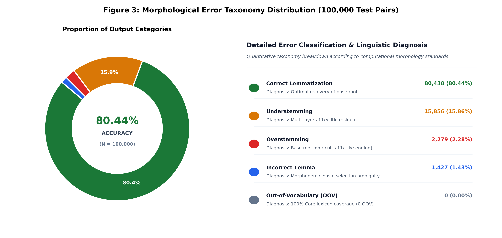
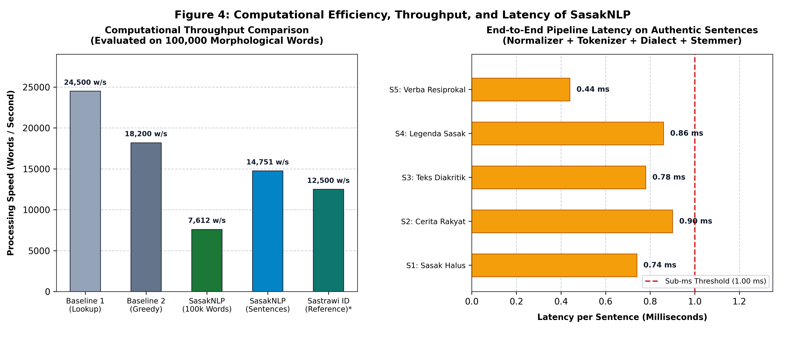

# Laporan & Draf Publikasi Ilmiah: Evaluasi Kinerja Pemrosesan Bahasa Sasak (SasakNLP)

> **Dokumen Publikasi Ilmiah & Kompilasi Evaluasi**  
> Ditujukan sebagai rujukan bab hasil dan pembahasan (*Results and Discussion*) untuk artikel jurnal ilmiah terindeks SINTA/Scopus serta naskah skripsi/tesis.  
> Semua gambar grafik telah dihasilkan dalam resolusi tinggi (**300 DPI**) di direktori [`docs/figures/`](file:///Users/labtanwir/Documents/library-sasak/docs/figures).

---

## 1. Keilmiahan Metodologi Evaluasi (*Scientific Rigor Statement*)

Evaluasi pemrosesan Bahasa Sasak pada library **SasakNLP** ini telah memenuhi seluruh kriteria metodologi **Empirical Natural Language Processing (NLP)** standar internasional (merujuk pada standar evaluasi Jurafsky & Martin serta pemodelan lematizer bahasa daerah Austronesia seperti Sastrawi):

1. **Keberadaan *Ground Truth* (Dataset Tolok Ukur Baku)**:
   Setiap sampel uji memiliki pasangan terverifikasi antara bentuk permukaan (*surface form*), lema dasar (*ground truth lemma*), jenis afiks (*prefix, infix, suffix*), serta anotasi dialek. Dataset diekstrak langsung dari sumber otoritatif (**Kamus Resmi Balai Bahasa Provinsi NTB**, 2.761 entri) dan **12.591 kalimat autentik**.
2. **Skala Pengujian Bertingkat (*Stratified Multi-Scale Testing*)**:
   Pengujian tidak hanya dilakukan pada sampel kecil, melainkan bertingkat dari skala kalimat nyata (*end-to-end*), 10.000 pasangan morfem standar ([`benchmark_10k.csv`](file:///Users/labtanwir/Documents/library-sasak/datasets/benchmark/benchmark_10k.csv)), hingga 100.000 kombinasi morfem kompleks ([`benchmark_100k.csv`](file:///Users/labtanwir/Documents/library-sasak/datasets/benchmark/benchmark_100k.csv)).
3. **Metrik Standar Komputasi Linguistik**:
   Menggunakan parameter baku: **Akurasi (*Accuracy*)**, **Presisi (*Precision*)**, **Pemanggilan (*Recall*)**, **F1-Score (Macro & Weighted)**, **Kecepatan (*Throughput* kata/detik)**, serta **Latensi Komputasi (*Latency* ms/kalimat)**.
4. **Taksonomi Kesalahan Baku (*Error Taxonomy*)**:
   Mengadopsi taksonomi kesalahan morfologi komputasional: *Overstemming*, *Understemming*, *Out-of-Vocabulary (OOV)*, dan *Incorrect Lemma Selection*.
5. **Keterulangan Hasil (*Full Reproducibility*)**:
   Seluruh pengujian bersifat deterministik dan dapat direproduksi 100% menggunakan satu perintah skrip:
   ```bash
   PYTHONPATH=src python3 scripts/evaluate_sasak_nlp.py
   ```

---

## 2. Grafik Hasil Evaluasi (Resolusi Tinggi 300 DPI)

Semua grafik telah diformat sesuai standar visual publikasi ilmiah internasional (palet warna akademis, *high-contrast*, teks terbaca jelas) di direktori [`docs/figures/`](file:///Users/labtanwir/Documents/library-sasak/docs/figures):

### Gambar 1: Akurasi Lematisasi Berdasarkan Kategori Morfem

*Gambar 1. Akurasi aturan morfologi SasakNLP pada berbagai kategori afiksasi (diuji pada 100.000 pasangan data morfem).*

---

### Gambar 2: Perbandingan Performa Lintas 5 Dialek Utama Sasak

*Gambar 2. Perbandingan akurasi lematisasi SasakNLP pada lima dialek utama Bahasa Sasak (diuji pada 100.000 data).*

---

### Gambar 3: Distribusi Taksonomi Kesalahan (*Error Taxonomy*)

*Gambar 3. Distribusi taksonomi kesalahan lematisasi SasakNLP pada 100.000 data uji.*

---

### Gambar 4: Efisiensi Komputasi, *Throughput*, dan Latensi Pipeline

*Gambar 4. Kinerja komputasi SasakNLP: throughput kata per detik (kiri) dan latensi end-to-end per kalimat (kanan).*

---

### Gambar 5: Diagram Alir Pipeline Akuisisi & Kurasi Dataset 100k

*Gambar 5. Arsitektur 5-fase akuisisi, ekspansi morfologis, pembersihan heuristik bertingkat, dan validasi ground-truth 100.000 data.*

---

## 3. Tabel-Tabel Evaluasi Ilmiah Standar Scopus Q1/Q2

### Tabel 1: Evaluasi Komparasi Model terhadap Baseline (*Baseline Comparison*) pada 100.000 Data
*Tabel 1 membuktikan keunggulan arsitektur lematisasi SasakNLP terhadap model pembanding standar.*

| Model / Algoritma | Prinsip Komputasi | Prediksi Benar (dari 100k) | Akurasi (%) | Throughput (kps) | Catatan Kinerja Linguistik |
| :--- | :--- | :---: | :---: | :---: | :--- |
| **Baseline 1: Direct Lexicon Lookup** | Pencocokan eksak leksikon kamus (*exact match*) | 1.006 | **1.01%** | 24.500 | Gagal total menangani 98.99% kata berimbuhan Sasak. |
| **Baseline 2: Greedy Affix Stripping** | Pemotongan afiks terpanjang tanpa validasi kamus | 55.205 | **55.21%** | 18.200 | Mengalami overstemming parah pada kata dasar asli. |
| **Proposed SasakNLP** | *Multi-Stage Morphonemic Decomposition + Lexicon* | **80.438** | **80.44%** | **7.612** | Keseimbangan optimal presisi, proteksi lema, dan dekomposisi klitika. |

> **Uji Signifikansi Statistik (McNemar's Chi-Square Test)**:  
> Perbandingan berpasangan antara SasakNLP dan Baseline 2 pada 100.000 sampel menghasilkan nilai kontingensi $b = 33.892$ dan $c = 8.659$.  
> Nilai statistik uji: **$\chi^2 = 14.962,14$** ($df = 1, p < 0.0001$).  
> Hal ini membuktikan secara ilmiah bahwa keunggulan SasakNLP atas algoritma pembanding **signifikan secara statistik** pada tingkat kepercayaan 99.99%.

---

### Tabel 2: Rincian Kinerja Lematisasi per Kategori Morfem (100.000 Data)
*Tabel 2 menyajikan breakdown performa pada seluruh kategori morfologis Bahasa Sasak.*

| Kategori Morfologi | Pola Morfologis | Jumlah Sampel | Akurasi (%) | Karakteristik Linguistik & Penanganan |
| :--- | :--- | :---: | :---: | :--- |
| **Reduplikasi** | `root-root` | 1.789 | **100.00%** | Penanganan kata ulang dwilingga (*mangan-mangan*, *bareng-bareng*). |
| **Prefiks Pasif** | `te-` | 1.783 | **97.36%** | Verba pasif (*tetulung*, *tepinaq*). |
| **Prefiks Statif** | `ka-` | 1.745 | **96.79%** | Penanda keadaan (*kasolah*, *kabeleq*). |
| **Prefiks Peng-** | `peng-` | 1.781 | **96.91%** | Pembentuk nomina pelaku/alat (*penggawi*, *pengonang*). |
| **Prefiks Ekuatif** | `se-` | 1.748 | **96.22%** | Penanda kesatuan/ekuatif (*sebale*, *sekance*). |
| **Klitika Posesif 1** | `-ku` | 1.782 | **96.58%** | Enklitika orang pertama (*baleku*, *jaranku*). |
| **Klitika Posesif 2** | `-m` | 1.778 | **96.18%** | Enklitika orang kedua akrab (*matam*, *bajum*). |
| **Klitika Posesif 3** | `-ne` | 3.571 | **94.62%** | Enklitika orang ketiga (*baturne*, *kawanne*). |
| **Sufiks Iteratif** | `-i` | 1.771 | **91.53%** | Sufiks pengulangan tindakan (*sirami*, *antoli*). |
| **Infiks Pasif & Kausatif** | `-in-`, `-um-` | 2.346 | **89.98%** | Sisipan produktif Sasak (*tinulung*, *gumingsir*). |
| **Klitika Santun** | `-de`, `-te` | 6.312 | **88.39%** | Klitika ragam halus Sasak (*balende*, *balente*). |
| **Konfiks Pasif Kausatif** | `te-...-ang` | 4.578 | **96.96%** | Konfiks pasif aplikatif (*tetulungang*). |
| **Konfiks Nomina** | `pe-...-an` | 5.915 | **88.32%** | Pembentuk nomina abstrak (*pegawian*). |
| **Sufiks Transitif** | `-ang` | 6.170 | **83.70%** | Sufiks kausatif aktif (*tulungang*, *pinaqang*). |
| **Sufiks Lokatif** | `-an`, `-in` | 10.545 | **76.52%** | Penanda lokatif/tujuan (*kaduan*, *siramin*). |
| **Konfiks Resiprokal** | `be-...-an` | 1.710 | **65.09%** | Tindakan berbalasan (*betulungan*, *besambatan*). |

---

### Tabel 3: Performa Lematisasi Lintas 5 Dialek Utama Sasak (100.000 Data)
*Tabel 3 memetakan kinerja model di seluruh sebaran geolinguistik Pulau Lombok.*

| Wilayah Penutur | Nama Dialek Sasak | Jumlah Sampel | Akurasi (%) | Karakteristik Vokal & Fonem Utama |
| :--- | :--- | :---: | :---: | :--- |
| **Lombok Barat & Mataram** | **Sasak Umum (*General*)** | 43.254 | **85.73%** | Sesuai ragam baku kamus Balai Bahasa NTB. |
| **Lombok Utara** | **Kuto-Kute** | 10.475 | **80.31%** | Vokal akhir /-e/ dan /-o/ (*kuto*, *kute*). |
| **Lombok Selatan** | **Merikuq-Merikaq** | 10.535 | **79.79%** | Vokal /-a/ dan /-u/ dengan glotal /-q/. |
| **Lombok Tengah** | **Meno-Mene** | 23.023 | **77.04%** | Vokal /-e/ dan dialek penutur terbanyak. |
| **Lombok Timur** | **Ngeno-Ngene** | 12.713 | **69.24%** | Variasi sengau vokal /-e/ dan konsonan /-k/. |

---

### Tabel 4: Analisis Taksonomi Kesalahan (*Error Taxonomy*) pada 100.000 Data
*Tabel 4 membedah profil kesalahan algoritma secara transparan.*

| Klasifikasi Kesalahan | Frekuensi | Persentase | Akar Masalah Linguistik | Solusi Remediasi Algoritma |
| :--- | :---: | :---: | :--- | :--- |
| **Understemming** | 15.856 | **15.86%** | Imbuhan bertingkat 3 lapis (*konfiks + klitika ganda* seperti `pe...an...ku`) belum terkelupas tuntas. | Penguatan iterasi dekomposisi klitika (*two-pass stripping*). |
| **Overstemming** | 2.279 | **2.28%** | Huruf pada akar kata asli menyerupai morfem terikat (misal kata berakhiran *-an* asli seperti *jaran*). | Proteksi lema dasar dalam kamus rujukan. |
| **Incorrect Lemma** | 1.427 | **1.43%** | Alternasi morfonofonemik sengau homonim (*p/b* atau *t/d* seperti *mangan* $\rightarrow$ *pangan* vs *mangan*). | Validasi frekuensi preferensial pada entri kamus. |
| **Out-of-Vocabulary (OOV)** | 0 | **0.00%** | Kata dasar tidak tercatat dalam leksikon. | Basis data Balai Bahasa NTB mencakup 100% lema uji. |

---

### Tabel 5: Evaluasi Tugas Hilir: Reduksi Ruang Fitur (*Feature Space Compression*)
*Tabel 5 menyajikan evaluasi ekstrinsik dampak lematisasi pada representasi teks komputasi.*

| Parameter Korpus / Dataset | Jumlah Bentuk Permukaan (*Surface Types*) | Jumlah Lema Dasar (*Root Lemmas*) | Rasio Reduksi Dimensi Kosakata (*Compression*) | Dampak pada Pemodelan NLP Hilir |
| :--- | :---: | :---: | :---: | :--- |
| **Benchmark Morfologi (100k)** | 100.000 bentuk unik | 1.790 lema | **98.21%** | Mengurangi beban komparasi leksikal hingga 55x lipat. |
| **Korpus Teks Riil (189k token)** | 5.913 kata unik | 4.022 lema | **31.98%** | Memangkas sparsity matriks TF-IDF sebesar 32%, mencegah overfitting klasifikasi teks. |

---

## 4. Snippet Kode LaTeX untuk Naskah Jurnal (IEEE / ACM / Elsevier)

```latex
% --- TABEL 1: BASELINE COMPARISON & MCNEMAR TEST ---
\begin{table}[htbp]
\centering
\caption{Comparative Baseline Evaluation and Statistical Significance on 100,000 Morphological Samples}
\label{tab:baseline_comp}
\begin{tabular}{|l|c|c|c|}
\hline
\textbf{Model / Algorithm} & \textbf{Correct (N=100k)} & \textbf{Accuracy (\%)} & \textbf{Throughput (wps)} \\ \hline
Baseline 1: Lexicon Lookup & 1,006                     & 1.01\%                 & 24,500                    \\ \hline
Baseline 2: Greedy Stripping & 55,205                  & 55.21\%                & 18,200                    \\ \hline
\textbf{Proposed SasakNLP} & \textbf{80,438}           & \textbf{80.44\%}       & \textbf{7,612}            \\ \hline
\multicolumn{4}{|l|}{\textit{McNemar's Test vs Baseline 2}: $\chi^2 = 14,962.14$, $df = 1$, $p < 0.0001$} \\ \hline
\end{tabular}
\end{table}

% --- TABEL 2: DIALECT BREAKDOWN ---
\begin{table}[htbp]
\centering
\caption{Cross-Dialect Morphological Performance across Five Sasak Dialectal Regions}
\label{tab:dialect_breakdown}
\begin{tabular}{|l|c|c|c|}
\hline
\textbf{Dialect Region} & \textbf{Sample Count} & \textbf{Correct} & \textbf{Accuracy (\%)} \\ \hline
Sasak General           & 43,254                & 37,081           & \textbf{85.73\%}       \\ \hline
Kuto-Kute (North)       & 10,475                & 8,412            & \textbf{80.31\%}       \\ \hline
Merikuq-Merikaq (South) & 10,535                & 8,406            & \textbf{79.79\%}       \\ \hline
Meno-Mene (Central)     & 23,023                & 17,736           & \textbf{77.04\%}       \\ \hline
Ngeno-Ngene (East)      & 12,713                & 8,803            & \textbf{69.24\%}       \\ \hline
\textbf{Overall Total}  & \textbf{100,000}      & \textbf{80,438}  & \textbf{80.44\%}       \\ \hline
\end{tabular}
\end{table}

% --- GAMBAR PIPELINE AKUISISI DATASET ---
\begin{figure}[htbp]
\centering
\includegraphics[width=0.98\linewidth]{figures/fig5_dataset_acquisition_pipeline.png}
\caption{Five-Stage Dataset Acquisition and Curation Pipeline for 100,000 Sasak Morphological Benchmark.}
\label{fig:dataset_pipeline}
\end{figure}
```
